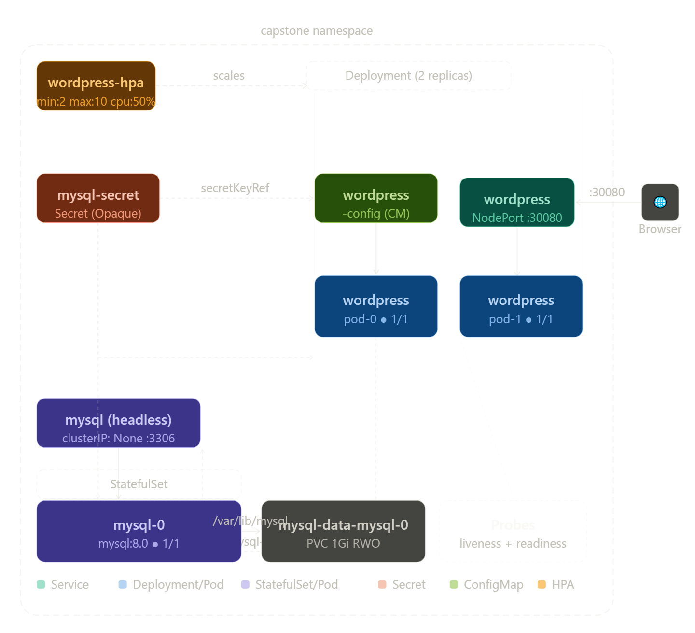

# Kubernetes WordPress + MySQL Capstone Project

> Ten days. Twelve concepts. One production-grade deployment.

<br>


---

## 📋 Table of Contents

- [Overview](#-overview)
- [Architecture](#-architecture)
- [Concepts Demonstrated](#-concepts-demonstrated)
- [Prerequisites](#-prerequisites)
- [Project Structure](#-project-structure)
- [Quick Start](#-quick-start)
- [Task-by-Task Walkthrough](#-task-by-task-walkthrough)
  - [Task 1 — Namespace](#task-1--create-the-namespace)
  - [Task 2 — MySQL](#task-2--deploy-mysql)
  - [Task 3 — WordPress](#task-3--deploy-wordpress)
  - [Task 4 — Expose WordPress](#task-4--expose-wordpress)
  - [Task 5 — Self-Healing & Persistence](#task-5--test-self-healing-and-persistence)
  - [Task 6 — HPA](#task-6--horizontal-pod-autoscaler)
  - [Task 7 — Helm Comparison](#task-7-bonus--helm-comparison)
  - [Task 8 — Cleanup](#task-8--cleanup)
- [Key Design Decisions](#-key-design-decisions)
- [Verification Checklist](#-verification-checklist)
- [Lessons Learned](#-lessons-learned)

---

## Overview

This capstone project deploys a full **WordPress + MySQL** stack on Kubernetes. It integrates the core concepts from **Days 1–9 of the Kubernetes-Practice** repository into a single, production-style application. All resources are organized within the `capstone` namespace and managed via the `manifests/` directory.

---

## Architecture



---

## 📚 Concepts Demonstrated

| # | Concept | Resource Created | Day Learned |
|---|---------|-----------------|-------------|
| 1 | **Namespace** | `capstone` | Day 52 |
| 2 | **Secret** | `mysql-secret` (stringData) | Day 54 |
| 3 | **ConfigMap** | `wordpress-config` | Day 54 |
| 4 | **StatefulSet** | `mysql` | Day 56 |
| 5 | **Headless Service** | `mysql` (clusterIP: None) | Day 53 |
| 6 | **PersistentVolumeClaim** | `mysql-data-mysql-0` (via volumeClaimTemplate) | Day 55 |
| 7 | **Deployment** | `wordpress` | Day 57 |
| 8 | **NodePort Service** | `wordpress` (:30080) | Day 53 |
| 9 | **Resource Requests & Limits** | Both MySQL and WordPress | Day 58 |
| 10 | **Liveness & Readiness Probes** | Both MySQL and WordPress | Day 57 |
| 11 | **HorizontalPodAutoscaler** | `wordpress-hpa` | Day 58 |
| 12 | **Helm** | `bitnami/wordpress` (bonus comparison) | Day 59 |

---

## ✅ Prerequisites

| Tool | Version | Install |
|------|---------|---------|
| `kubectl` | 1.28+ | [docs.k8s.io](https://kubernetes.io/docs/tasks/tools/) |
| `minikube` or `kind` | latest | [minikube.sigs.k8s.io](https://minikube.sigs.k8s.io/) / [kind.sigs.k8s.io](https://kind.sigs.k8s.io/) |
| `helm` | 3.x | [helm.sh/docs](https://helm.sh/docs/intro/install/) |
| Metrics Server | enabled | `minikube addons enable metrics-server` |

> **Minikube users** — start your cluster with enough resources:
> ```bash
> minikube start --cpus=4 --memory=4096
> minikube addons enable metrics-server
> ```

---

## 📁 Project Structure

```bash
kubernetes-wordpress-mysql-capstone/
│
├── README.md
│
├── manifests/
│   ├── namespace.yaml              # capstone namespace
│   ├── mysql-secret.yaml           # MySQL credentials (Secret / stringData)
│   ├── mysql-headless-service.yaml # Headless Service for StatefulSet DNS
│   ├── mysql-statefulset.yaml      # MySQL StatefulSet + volumeClaimTemplate
│   ├── wordpress-configmap.yaml    # DB host + DB name (ConfigMap)
│   ├── wordpress-deployment.yaml   # WordPress Deployment + probes
│   ├── wordpress-service.yaml      # NodePort Service (:30080)
│   └── hpa.yaml                    # HPA (min:2, max:10, cpu:50%)
│
├── screenshots/
│   ├── wordpress-ui.png            # WordPress setup / site running
│   ├── kubectl-get-all.png         # kubectl get all -n capstone output
│   └── hpa-output.png              # kubectl get hpa -n capstone output
│
└── docs/
    └── architecture-diagram.png    # Full stack architecture diagram
```

---

## ⚡ Quick Start

```bash
# 1. Clone the repo
git clone https://github.com/<your-username>/kubernetes-wordpress-mysql-capstone.git
cd kubernetes-wordpress-mysql-capstone

# 2. Apply all manifests in order
kubectl apply -f manifests/namespace.yaml
kubectl apply -f manifests/mysql-secret.yaml
kubectl apply -f manifests/mysql-headless-service.yaml
kubectl apply -f manifests/mysql-statefulset.yaml
kubectl apply -f manifests/wordpress-configmap.yaml
kubectl apply -f manifests/wordpress-deployment.yaml
kubectl apply -f manifests/wordpress-service.yaml
kubectl apply -f manifests/hpa.yaml

# 3. Set capstone as default namespace
kubectl config set-context --current --namespace=capstone

# 4. Wait for all pods to be ready
kubectl wait pod/mysql-0 --for=condition=Ready --timeout=120s -n capstone
kubectl wait deployment/wordpress --for=condition=Available --timeout=120s -n capstone

# 5. Access WordPress
# Minikube:
minikube service wordpress -n capstone

# Kind / kubeadm:
kubectl port-forward svc/wordpress 8080:80 -n capstone
# Then open http://localhost:8080
```

---

## 🔧 Task-by-Task Walkthrough

### Task 1 — Create the Namespace

```bash
kubectl apply -f manifests/namespace.yaml
kubectl config set-context --current --namespace=capstone
```

Every resource in this project is scoped to the `capstone` namespace. This means a single `kubectl delete namespace capstone` tears everything down cleanly.

---

### Task 2 — Deploy MySQL

```bash
kubectl apply -f manifests/mysql-secret.yaml
kubectl apply -f manifests/mysql-headless-service.yaml
kubectl apply -f manifests/mysql-statefulset.yaml

# Wait for mysql-0 to be ready
kubectl wait pod/mysql-0 --for=condition=Ready --timeout=120s -n capstone
```

**Verify the `wordpress` database exists:**

```bash
kubectl exec -it mysql-0 -n capstone -- \
  mysql -u wpuser -pwpP@ssw0rd! -e "SHOW DATABASES;"
```

Expected output:
```
+--------------------+
| Database           |
+--------------------+
| information_schema |
| wordpress          |   ← ✅
+--------------------+
```

**Why a StatefulSet?** Unlike Deployments, StatefulSets give each pod a stable, predictable name (`mysql-0`) and a dedicated PVC that persists across restarts. The pod may be deleted, but its data lives on in the PVC.

**Why a Headless Service?** Setting `clusterIP: None` means Kubernetes DNS resolves the pod directly at `mysql-0.mysql.capstone.svc.cluster.local`, not through a load-balancing VIP. This stable DNS name is what WordPress uses to connect to the database.

---

### Task 3 — Deploy WordPress

```bash
kubectl apply -f manifests/wordpress-configmap.yaml
kubectl apply -f manifests/wordpress-deployment.yaml

# Watch both pods reach 1/1 Running
kubectl get pods -n capstone -l app=wordpress -w
```

Expected output:
```
NAME                         READY   STATUS    RESTARTS
wordpress-7d9f8b6c4-xk2pq   1/1     Running   0
wordpress-7d9f8b6c4-mn8qr   1/1     Running   0
```

**`envFrom` vs `secretKeyRef`** — the ConfigMap is injected wholesale via `envFrom` (it's non-sensitive). The MySQL credentials are cherry-picked from the Secret using `secretKeyRef` — this way the Secret is never accidentally exposed in a ConfigMap dump.

**Probes** — the readiness probe (delay: 30s) ensures no traffic reaches a pod until WordPress is fully booted. The liveness probe (delay: 60s) restarts the pod if it becomes unhealthy, but gives it enough time to start first.

---

### Task 4 — Expose WordPress

```bash
kubectl apply -f manifests/wordpress-service.yaml

# Minikube
minikube service wordpress -n capstone

# Kind / port-forward
kubectl port-forward svc/wordpress 8080:80 -n capstone
```

Open your browser, complete the WordPress setup wizard, and create a test blog post. You'll verify this post survives pod deletion in the next task.

---

### Task 5 — Test Self-Healing and Persistence

**Test 1 — WordPress pod recovery:**

```bash
# Delete one pod
kubectl delete pod <wordpress-pod-name> -n capstone

# Watch Deployment recreate it immediately
kubectl get pods -n capstone -l app=wordpress -w
```

The second pod keeps serving traffic while the Deployment controller spins up a replacement. The readiness probe ensures the new pod isn't added to the Service until it's ready.

**Test 2 — MySQL recovery + data persistence:**

```bash
kubectl delete pod mysql-0 -n capstone

# Watch StatefulSet recreate mysql-0 (same name, same PVC)
kubectl get pods -n capstone -l app=mysql -w
```

Once `mysql-0` is `1/1 Running`, refresh WordPress in your browser. Your blog post is still there — the PVC was never deleted, only re-attached.

```bash
# Confirm data survived
kubectl exec -it mysql-0 -n capstone -- \
  mysql -u wpuser -pwpP@ssw0rd! wordpress \
  -e "SELECT post_title FROM wp_posts WHERE post_status='publish';"
```

---

### Task 6 — Horizontal Pod Autoscaler

```bash
kubectl apply -f manifests/hpa.yaml

kubectl get hpa -n capstone
```

Expected output:
```
NAME            REFERENCE              TARGETS   MINPODS   MAXPODS   REPLICAS
wordpress-hpa   Deployment/wordpress   8%/50%    2         10        2
```

The HPA scales WordPress out when average CPU exceeds 50%, up to 10 replicas. The `scaleDown.stabilizationWindowSeconds: 300` prevents flapping — it waits 5 minutes of sustained low CPU before scaling back in.

**Full stack view:**

```bash
kubectl get all -n capstone
```

---

### Task 7 (Bonus) — Helm Comparison

```bash
# Add Bitnami repo and install in a separate namespace
helm repo add bitnami https://charts.bitnami.com/bitnami
helm repo update
helm install wp-helm bitnami/wordpress \
  --namespace wp-helm \
  --create-namespace

# Compare resource counts
kubectl get all -n capstone | wc -l      # Manual: ~8 manifests
kubectl get all -n wp-helm  | wc -l      # Helm: 20+ auto-generated
```

| | Manual (this repo) | Helm (`bitnami/wordpress`) |
|---|---|---|
| **Resources** | 8 manifests, fully controlled | 20+ auto-generated |
| **Control** | Total — every field is yours | Partial — `values.yaml` overrides |
| **Repeatability** | Kustomize or script | `helm install` (one command) |
| **Upgrades** | `kubectl apply` per file | `helm upgrade` with rollback |
| **Learning value** | ⭐⭐⭐⭐⭐ | ⭐⭐ |
| **Production speed** | Slower initially | Fast from day one |

```bash
# Clean up Helm deployment
helm uninstall wp-helm -n wp-helm
kubectl delete namespace wp-helm
```

---

### Task 8 — Cleanup

```bash
# Final view
kubectl get all -n capstone
kubectl get pvc,secrets,configmaps -n capstone

# Delete EVERYTHING in one command
kubectl delete namespace capstone

# Reset default namespace
kubectl config set-context --current --namespace=default

# Verify it's gone
kubectl get all -n capstone   # Error from server (NotFound) ✅
```

Deleting the namespace cascades to all resources inside it. PVCs are deleted too; underlying PersistentVolumes may be retained depending on your storage class `reclaimPolicy`.

---

## 🧠 Key Design Decisions

**StatefulSet over Deployment for MySQL**
StatefulSets provide stable pod identity (`mysql-0`) and per-pod PVCs. A Deployment would give random pod names and no guarantee of dedicated storage — wrong for any database.

**Headless Service for stable DNS**
`clusterIP: None` tells Kubernetes not to create a virtual IP. Instead, DNS resolves directly to the pod IP, giving us the predictable `pod.service.namespace.svc.cluster.local` address pattern that WordPress depends on.

**Mixing `envFrom` and `secretKeyRef`**
The ConfigMap is safe to bulk-inject (`envFrom: configMapRef`). The Secret holds credentials that should only be exposed as specific named variables — using `secretKeyRef` per-key prevents accidental leakage of unrelated credentials.

**Probe timing (`initialDelaySeconds`)**
The readiness probe fires at 30s — enough for WordPress to connect to MySQL and initialise. The liveness probe fires at 60s — it intentionally waits longer so a slow-starting pod is never killed before it has a chance to become ready.

**HPA scale-down window (300s)**
Traffic spikes are real and short. Setting `scaleDown.stabilizationWindowSeconds: 300` means the HPA won't scale back in during a brief lull between spikes, avoiding constant pod churn.

---

## ✅ Verification Checklist

Run these commands to confirm every component is working:

```bash
# Namespace exists
kubectl get namespace capstone

# All pods running
kubectl get pods -n capstone

# MySQL has the wordpress database
kubectl exec -it mysql-0 -n capstone -- \
  mysql -u wpuser -pwpP@ssw0rd! -e "SHOW DATABASES;"

# PVC is bound
kubectl get pvc -n capstone

# HPA shows correct targets
kubectl get hpa -n capstone

# Services are up
kubectl get svc -n capstone

# Full picture
kubectl get all -n capstone
```

---

## 💡 Lessons Learned

1. **Namespaces are blast-radius control** — scoping everything to one namespace means `kubectl delete namespace capstone` cleanly removes 12+ resources in one shot.

2. **The StatefulSet DNS trick only works with a Headless Service** — without `clusterIP: None`, there's no stable pod-level DNS name, only a VIP that load-balances. That's wrong for a primary database.

3. **Probes need realistic timing** — setting `initialDelaySeconds` too low causes crash loops. Too high delays traffic recovery. Knowing your app's boot time is the key input.

4. **Secrets at the key level, not file level** — using `secretKeyRef` to pull individual keys forces you to be intentional about which credentials each workload actually needs.

5. **Manual manifests beat Helm for learning** — Helm is faster to operate, but you can't debug what you don't understand. Building this by hand first means Helm's generated YAML is readable, not opaque.

---

## 📄 License

MIT — see [LICENSE](LICENSE) for details.

---

<div align="center">
**Shibnath Das**

DevOps / Cloud Infrastructure Engineer
</div>
